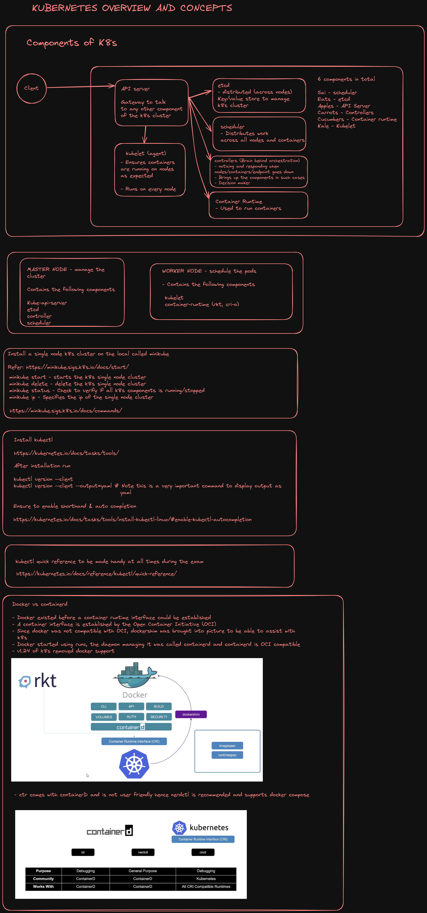
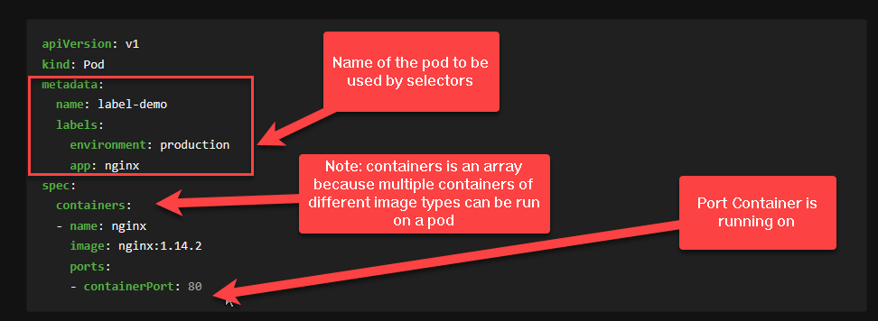

# Kubernetes Overview

## Container Orchestration
##### **Automatically deploying and managing container**

 *  Kubernetes  
 *  Docker swarm
 *  Mesos

## Kubernetes Architecture


## K8s concepts

*Note: Always remember to make sure which namespace you are working on*

### Pods

* Short hand is "po"
* Smallest object your can create in K8
* Contains one or more containers. Containers cannot be of the same type cannot be run on a pod
* Runs on a Worker Node
* Pods have a one to one relationship with containers
* Pods are transient, they do not store any information persistently unless we specify persistent volumes
* Single pod can have multiple containers which are not of the same type

### Pod basic yaml definition



#### Commands
```
# Imperative command to run a pod
kubectl run <pod-name> --image <image-name:version>

# Imperative command to run a pod with a --watch
kubectl run <pod-name> --image <image-name:version> --watch

# Imperative commadn to do a quick dry run to check the pod specification
# This can be piped to a file
kubectl run nginx --image=nginx --dry-run=client 

# Getting a list of pods across all namespaces
kubectl get pods --all-namespaces 

# Counting a list of pods across all namespaces
# NOTE: The output is one less than the count provided
kubectl get pods --all-namespaces  | wc -l

# Getting a pods yaml file
kubectl get pod my-pod -o yaml 
 
# Be thorough with all the semantics of pods from this output at all times
# This provide more information of which worker node the pod is deployed or scheduled in
kubectl get pods -o wide

# delete a pod which was created from a defintion file
kubectl delete pod -f <pod-definition.yml>

# Delete a pod
kubectl delete pod <pod-name> -n <namespace>

#Force Delete the pod
kubectl delete pod <pod-name> -n <namespace> --force

# Finding the image used to create a  pod
# Note: Word image is in Caps
kubectl describe pod <pod-name> | grep "Image"

# Getting the total number of containers in a pod
kubectl describe pod <pod-name> | grep "Container ID"

# Get the status of the pod
# Look at the last line after describing the pod or look at status
kubectl get pod

# To see why a container is not running, look at the "Events" section
kubectl describe pod <pod-name>

# To get all pods
# To fetch the "no of containers running/total containers"  running
# in the pod look at the "status" column using the following command
kubectl get pods 

# Edit a pod, Change some parameters, Write to a file
kubectl edit pod <pod-name>

# Gets the pod definition as a yaml file
kubectl get pod <pod-name> -o yaml

# Describing all pods
kubectl get pods

# Create vs apply command
# Note this applies to not just pods but to any object
# Imperative Management vs Declarative Management
# Imperative management means giving a series of instructions or steps to reach the goal. We specify what and how we should reach the goal.
# This is where we tell K8S what to create, replace, delete, etc., using the API. Objects are created and managed using the kubectl command on the command line interface (CLI).
# Declarative management is where we specify the required outcome, not the individual steps needed to achieve that outcome.
# For each kind of resource specified in our YAML configuration files, a dedicated controller checks what we currently have and tries to converge it with what we want.
# create is imperative, if the resource already exists, this command will error.
# apply is declarative, If the resource already exists, this command will not error.
kubectl create -f <file-name-definition> - Imperative command
kubectl apply (-f FILENAME | -k DIRECTORY)
```

#### Note when editing pods

```shell
# Editing pods is not possible for the following specification
# spec.containers[*].image
#spec.initContainers[*].image
# spec.activeDeadlineSeconds
# spec.tolerations

# The best way to edit a running pod is to do the following steps

# 1. Get the description of a pod write to a yaml file
kubectl get pod <pod-name> -o yaml > temp-pod-defn.yml
# 2 - Open the yaml file to edit and make the changes
nano temp-pod-defn.yml
# 3 - Delete the current pod
kubectl delete pod <pod-name>
# 4- Create the pod again from the file
kubectl create -f temp-pod-defn.yml
```